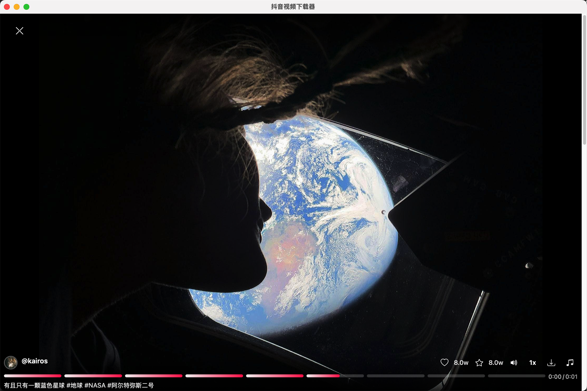

<div align="center">


# Douyin Downloader

**抖音视频下载器 - Rust 重构版**

[](https://www.rust-lang.org/)
[](https://tauri.app/)
[](LICENSE)
[]()

</div>

---

## 简介

本项目是 [DY_video_downloader](https://github.com/anYuJia/DY_video_downloader) 的 Rust 重构版本。

使用 Rust + Tauri 2.0 重写，相比 Python 版本具有以下优势：

- **更小体积** - 打包后约 10MB，相比 Python 打包版 100MB+ 大幅减小
- **更低内存** - 原生应用，内存占用更低
- **更快启动** - 无需 Python 解释器，启动速度显著提升
- **跨平台** - 原生支持 Windows / macOS / Linux

---

## 功能特性

| 功能 | 描述 |
|:---|:---|
| 用户检索 | 支持昵称 / 抖音号 / 链接搜索用户 |
| 批量下载 | 一键下载用户全部作品 |
| 推荐视频 | 浏览推荐 feed，沉浸式预览 |
| 点赞获取 | 获取自己点赞的视频列表 |
| 实时进度 | WebSocket 推送下载进度 |
| 多种格式 | 支持视频、图集、Live Photo |
| 质量选择 | 可选最高质量 / 兼容优先 / 最小体积 |
| 浏览器登录 | 内置浏览器，一键登录抖音账号 |

---

## 界面预览

<p align="center">
  
</p>

<p align="center">
  
</p>

<p align="center">
  
</p>

---

## 下载安装

从 [Releases](../../releases/latest) 下载对应平台的安装包：

| 平台 | 文件 |
|:---|:---|
| Windows | `.exe` 安装包或便携版 |
| macOS | `.dmg` 或 `.app` 便携版 |
| Linux | `.deb` 或 `.AppImage` |

> **macOS 用户**：首次运行可能提示"无法验证开发者"，执行：
> ```bash
> sudo xattr -rd com.apple.quarantine /Applications/Douyin\ Downloader.app
> ```

---

## 从源码构建

### 环境要求

- Rust 1.70+
- Node.js 18+ (可选，用于前端开发)
- 系统依赖见 [Tauri 官方文档](https://tauri.app/start/prerequisites/)

### 构建步骤

```bash
# 克隆仓库
git clone https://github.com/anYuJia/douyin-downloader-rust.git
cd douyin-downloader-rust

# 开发模式运行
cd src-tauri
cargo tauri dev

# 构建发布版
cargo tauri build
```

---

## 技术栈

- **后端**: Rust + Tauri 2.0
- **前端**: 原生 HTML/CSS/JavaScript + Bootstrap 5
- **通信**: WebSocket 实时推送

---

## 相关项目

- [DY_video_downloader](https://github.com/anYuJia/DY_video_downloader) - Python 原版

---

## 免责声明

本工具仅供个人学习研究使用，请勿用于商业用途或大规模爬取。因滥用导致的后果，项目贡献者不承担责任。

---

<p align="center">觉得有用？给个 ⭐ Star 支持一下</p>
